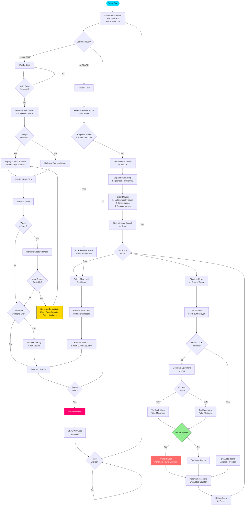

```mermaid
flowchart TD
    Start([Game Start]) --> InitBoard[Initialize 8x8 Board<br/>Red: rows 5-7<br/>Black: rows 0-2]
    InitBoard --> WaitPlayer{Current Player?}
    
    WaitPlayer -->|Human RED| HumanTurn[Wait for Click]
    HumanTurn --> ValidateClick{Valid Piece<br/>Selected?}
    ValidateClick -->|No| HumanTurn
    ValidateClick -->|Yes| GenMoves[Generate Valid Moves<br/>for Selected Piece]
    
    GenMoves --> CheckJumps{Jumps<br/>Available?}
    CheckJumps -->|Yes| ShowJumps[Highlight Jump Squares<br/>Mandatory Captures]
    CheckJumps -->|No| ShowRegular[Highlight Regular Moves]
    
    ShowJumps --> WaitMove[Wait for Move Click]
    ShowRegular --> WaitMove
    WaitMove --> ExecuteMove[Execute Move]
    
    ExecuteMove --> IsJump{Was it<br/>a Jump?}
    IsJump -->|No| CheckPromotion
    IsJump -->|Yes| RemoveCaptured[Remove Captured Piece]
    RemoveCaptured --> CheckMulti{More Jumps<br/>Available?}
    
    CheckMulti -->|Yes| MultiJump[Set Multi-Jump State<br/>Keep Piece Selected<br/>Gold Highlights]
    MultiJump --> ShowJumps
    CheckMulti -->|No| CheckPromotion
    
    CheckPromotion{Reached<br/>Opposite End?} -->|Yes| PromoteKing[Promote to King<br/>Show Crown]
    CheckPromotion -->|No| SwitchPlayer
    PromoteKing --> SwitchPlayer[Switch to BLACK]
    
    SwitchPlayer --> CheckWin{Game<br/>Over?}
    CheckWin -->|Yes| EndGame[Display Winner]
    CheckWin -->|No| WaitPlayer
    
    WaitPlayer -->|AI BLACK| AIStart[Start AI Turn]
    AIStart --> ResetStats[Reset Position Counter<br/>Start Timer]
    ResetStats --> CheckRandom{Beginner Mode<br/>& Random < 0.4?}
    
    CheckRandom -->|Yes| RandomMove[Pick Random Move<br/>Prefer Jumps 70%]
    CheckRandom -->|No| GetAllMoves[Get All Legal Moves<br/>for BLACK]
    
    GetAllMoves --> ExpandMultiJump[Expand Multi-Jump<br/>Sequences Recursively]
    ExpandMultiJump --> OrderMoves[Order Moves:<br/>1. Multi-jumps by count<br/>2. Single jumps<br/>3. Regular moves]
    
    OrderMoves --> MinimaxRoot[Start Minimax Search<br/>at Root]
    MinimaxRoot --> LoopMoves{For Each<br/>Move}
    
    LoopMoves --> SimMove[Simulate Move<br/>on Copy of Board]
    SimMove --> MinimaxRecurse[Call Minimax<br/>depth-1, MIN layer]
    
    MinimaxRecurse --> MinimaxCheck{depth = 0 OR<br/>Terminal?}
    MinimaxCheck -->|Yes| EvalBoard[Evaluate Board<br/>Material + Position]
    MinimaxCheck -->|No| GenOppMoves[Generate Opponent<br/>Moves]
    
    GenOppMoves --> MinLayer{Current<br/>Layer?}
    MinLayer -->|MAX| MaxLoop[Try Each Move<br/>Take Maximum]
    MinLayer -->|MIN| MinLoop[Try Each Move<br/>Take Minimum]
    
    MaxLoop --> AlphaBeta{Beta ≤ Alpha?}
    MinLoop --> AlphaBeta
    AlphaBeta -->|Yes| Prune[Prune Branch<br/>Increment Prune Counter]
    AlphaBeta -->|No| Continue[Continue Search]
    
    Prune --> IncrementPos[Increment Positions<br/>Evaluated Counter]
    Continue --> IncrementPos
    EvalBoard --> IncrementPos
    
    IncrementPos --> ReturnScore[Return Score<br/>to Parent]
    ReturnScore --> LoopMoves
    
    LoopMoves -->|Done| SelectBest[Select Move with<br/>Best Score]
    RandomMove --> SelectBest
    
    SelectBest --> RecordTime[Record Think Time<br/>Update Dashboard]
    RecordTime --> ExecuteAIMove[Execute AI Move<br/>or Multi-Jump Sequence]
    ExecuteAIMove --> SwitchPlayer
    
    EndGame --> ShowResult[Show Win/Loss<br/>Message]
    ShowResult --> WaitReset{Reset<br/>Clicked?}
    WaitReset -->|Yes| InitBoard
    WaitReset -->|No| WaitReset
    
    style Start fill:#00d9ff,stroke:#fff,color:#000
    style EndGame fill:#ff006e,stroke:#fff,color:#fff
    style MultiJump fill:#ffd700,stroke:#000,color:#000
    style AlphaBeta fill:#90EE90,stroke:#000,color:#000
    style Prune fill:#ff6b6b,stroke:#fff,color:#fff
```
